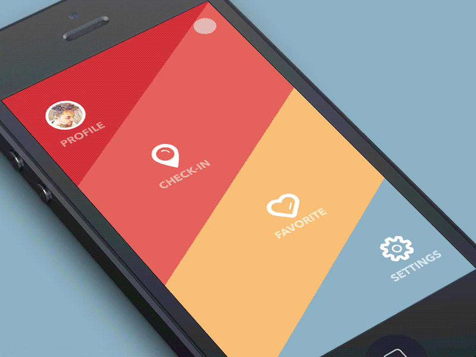

# Webcam App

App demonstrating ...

Live version: https://webcam-app.herokuapp.com/



## Tech stack
* Node
* Express
* Heroku
* Vanilla JavaScript
* ES6
* Flexbox

## Getting started

```sh
git clone https://github.com/PiotrBerebecki/webcam-app.git
cd webcam-app
npm install

#1. Start the development server with Browsersync reloading
npm run dev

#2. Open this url in your browser: http://localhost:3000/public/index.html
```
